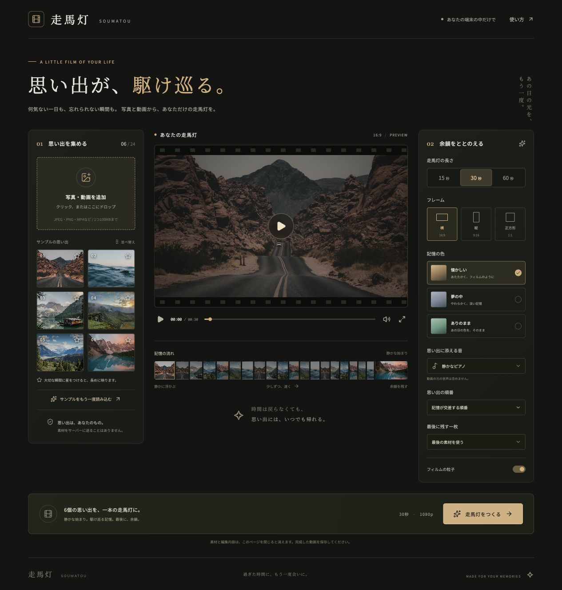

# 走馬灯 — SOUMATOU

**写真と動画から、記憶が駆け巡る一本を。**

素材をまとめて選ぶと、静かな始まり、交差する記憶、加速する切り替え、最後の一枚の余韻で構成された「走馬灯」をつくれます。素材の処理、映像の描画、BGMの生成、動画のエンコードはブラウザ内で行います。アカウント、APIキー、バックエンドは不要です。



## 起動

Node.js 22.12以上（推奨24）とnpmを使います。

```sh
npm ci
npm run dev
```

表示されたローカルURLを開いてください。まずは「サンプルで試す」から写真6枚を読み込めます。

## できること

- 写真・動画を最大24個まとめて追加。1ファイル100MBまで。
- ドラッグ、または矢印ボタンで並べ替え。削除や追加にも対応。
- 大切な瞬間に星をつけると、その素材の表示時間が長くなる。
- 15・30・60秒、横（16:9）・縦（9:16）・正方形（1:1）。
- 懐かしい／夢の中／ありのままの色、ズーム、クロスフェード、粒子、周辺減光。
- 交差する順番／並べた順番、最後に残す一枚の指定。
- オリジナルの合成ピアノ・アンビエントBGM、または無音。
- 再生、一時停止、タイムラインからの移動、全画面プレビュー。
- 1080p・30fpsの動画を作成し、完成動画を確認して保存。進捗表示とキャンセルに対応。
- モバイル画面では、素材と演出のパネルをタブで切り替える。

## 動画の書き出し・対応環境

最新のChrome、Edge、Safariの、WebCodecsに対応する環境が対象です。HTTPSまたはlocalhostで利用してください。

[Mediabunny](https://mediabunny.dev/guide/writing-media-files)でフレームをエンコードします。H.264と、BGMがある場合はAACを利用できればMP4に、利用できない場合はVP9とOpusを使ったWebMに書き出します。利用できるエンコーダーがなければ画面に理由を表示します。拡張子は実際の出力形式に合わせます。

動画素材の対応形式はブラウザのデコーダーによります。MP4（H.264）、JPEG、PNG、WebPが使いやすい形式です。HEICや特殊な動画形式は変換が必要になる場合があります。動画の各場面は先頭から表示し、短い素材は最後のフレームを保持します。トリミング区間の指定、動画の元の音声の合成にはまだ対応していません。

メモリ上でエンコードするため、素材の大きさ、枚数、端末性能によって処理時間と使用メモリが増えます。素材は画面に合わせて中央でトリミングされます。出力するBGMの音量と、プレビューのミュート設定は独立しています。

## 保存・プライバシー

素材をサーバーへアップロードする機能はありません。素材、編集内容、完成動画はこのページのセッションだけに保持され、再読み込みやページを閉じると失われます。完成動画は「動画を保存する」から端末へ保存してください。

サンプル写真は同梱しています。表示用フォントの読み込みでGoogle Fontsに接続しますが、写真や動画を送信することはありません。BGMはアプリ独自の音声合成で生成します。AI APIやローカルモデルは使用しません。

## 開発・検証

```sh
npm test
npm run build
npm run preview
```

テストは、指定尺を埋めること、全素材を含むこと、切り替えの加速、星による表示時間の変化、最後の素材、並び順、場面の境界、出力サイズを検証します。GitHub Actionsでもテストと本番ビルドを実行します。

`dist/` を任意の静的ホスティングで公開できます。公開作業やユーザー素材の永続保存は本リポジトリには含まれません。

技術構成：React、TypeScript、Vite、Canvas 2D、Web Audio、WebCodecs、Mediabunny、Lucide。

## サンプル写真

Unsplashの画像をサンプルとして同梱しています（[Unsplash License](https://unsplash.com/license)）。画像の提供元：

- [いつかの旅](https://images.unsplash.com/photo-1500530855697-b586d89ba3ee)
- [海の記憶](https://images.unsplash.com/photo-1518837695005-2083093ee35b)
- [静かな朝](https://images.unsplash.com/photo-1470770841072-f978cf4d019e)
- [深呼吸](https://images.unsplash.com/photo-1470071459604-3b5ec3a7fe05)
- [遠くへ](https://images.unsplash.com/photo-1464822759023-fed622ff2c3b)
- [帰り道](https://images.unsplash.com/photo-1493246507139-91e8fad9978e)
